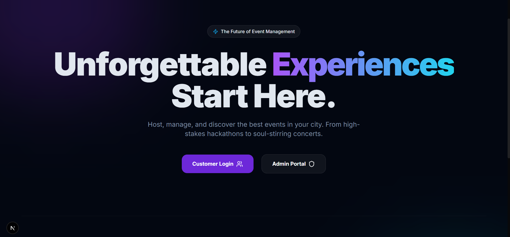
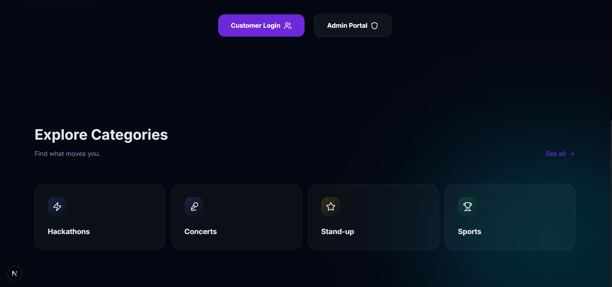
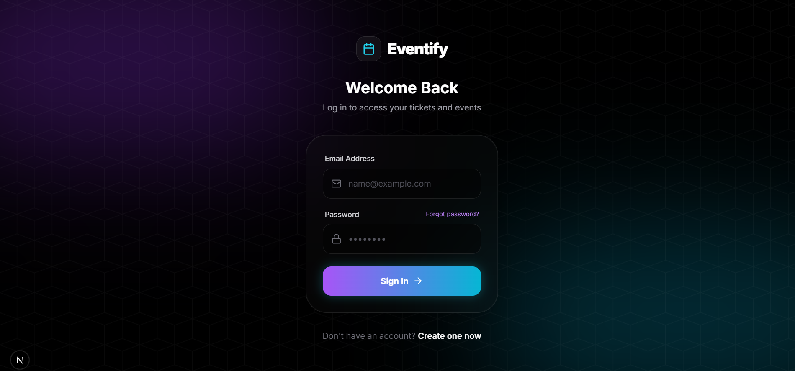
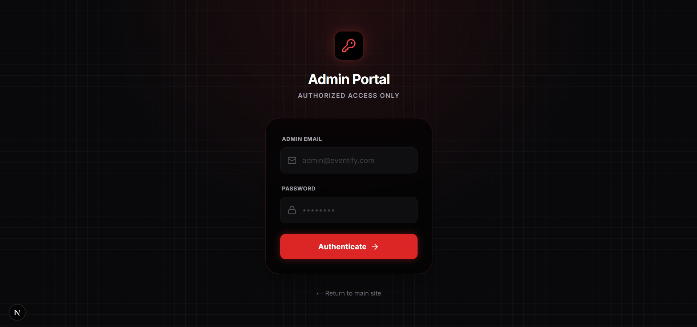

# 🎫 Eventify — Premium Event Management

<div align="center">
  
  <p><i>The Future of Event Management. Host, manage, and discover the best events in your city.</i></p>
</div>

---

## 🌟 Overview

**Eventify** is a modern full-stack event management platform designed with a premium **glassmorphic UI**.

Whether you're a customer looking for the next big hackathon or an administrator managing a large event, **Eventify provides a seamless and intuitive experience.**

---

## 🎭 Dual-Portal Experience

### 👤 Customer Portal
- Discover upcoming events
- Filter events by category
- Reserve seats and book tickets
- Manage personal bookings

### 🛠 Admin Command Center
- Create and manage events
- Control event status (draft, published, closed)
- Track bookings and attendance
- Manage platform data

---

## 📸 Screenshots

| 🏠 Landing Page | 📂 Categories |
| :---: | :---: |
|  |  |

| 🔐 User Login | 🛡 Admin Authentication |
| :---: | :---: |
|  |  |

---

## 🚀 Core Features

- ⚡ **Instant Event Discovery** – Browse and filter events by categories
- 🔐 **Secure Authentication** – Role-based authentication using NextAuth
- 🎟 **Smart Ticket Booking** – Real-time event seat reservation
- 📊 **Admin Event Management** – Full control of event lifecycle
- 🎨 **Premium UI/UX** – Glassmorphic modern interface with smooth animations

---

## 🛠 Tech Stack

| Technology | Purpose |
|------------|---------|
| **Next.js** | Full-stack React framework |
| **Tailwind CSS** | UI styling |
| **PostgreSQL (Neon)** | Cloud database |
| **Prisma ORM** | Database management |
| **NextAuth.js** | Authentication system |
| **Framer Motion** | UI animations |
| **Lucide Icons** | Icon system |

---

## ⚙️ Installation & Setup

### 1️⃣ Clone Repository

```bash
git clone https://github.com/guptavidur/Eventify.git
cd Eventify
npm install
